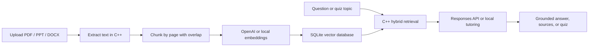
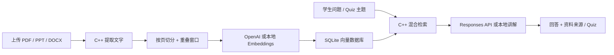

# Truth Learning

> Go far by starting near; stay diligent without pause.<br>
> 行远自迩，笃行不怠。

[English](#english) · [中文](#中文)

## English

Truth Learning is a C++20-powered AI study assistant designed for everyone. Users can upload learning materials in PDF, PPT, PPTX, DOCX, TXT, Markdown, and CSV formats. The system extracts text, divides it into knowledge chunks, generates embeddings, and stores them in a local SQLite vector database.

When a user asks a question, Truth Learning retrieves relevant passages from the uploaded materials and provides them to the AI for grounded answers, instructional explanations, and quiz generation. Responses include the source document and page number whenever available, helping reduce unsupported answers outside the course material.

Truth Learning also records daily and total study time. The home page displays “You have studied for x.x hours today” and offers gentle encouragement based on the learner’s study duration.

### Core Features

- **Courseware upload:** Supports PDF, PPT/PPTX, DOCX, TXT, Markdown, and CSV.
- **Intelligent knowledge base:** Automatically extracts text, chunks content, generates embeddings, and stores vectors.
- **Grounded Q&A:** Prioritizes answers based on uploaded materials and displays source references.
- **AI tutoring:** Summarizes key knowledge, explains difficult concepts, provides examples, and suggests review paths.
- **Active-recall quizzes:** Generates multiple-choice questions, answer explanations, and source page references.
- **Study-time tracking:** Displays today’s study time and records total time and seven-day trends in the profile center.
- **Local fallback:** Without an OpenAI API key, local vector retrieval and basic grounded answers remain available.
- **Privacy by default:** Documents, vectors, and learning records are stored in the user’s own SQLite database by default.

### Design Philosophy

Make learning simpler for everyone.

The interface uses low-stimulation sage green, mist blue, and warm white. Its orderly, square layout reduces unnecessary visual noise and helps learners stay calm and focused.

### How It Works



Web browsers require HTML, CSS, and JavaScript to render the interface. In Truth Learning, JavaScript is limited to user interaction and API calls; business logic and data processing are handled by the C++ backend.

### Quick Start with Docker

```bash
cp .env.example .env
# Optional: add OPENAI_API_KEY to .env
docker compose up --build
```

Open <http://localhost:8080>.

### Local Build

Requirements:

- CMake 3.24+
- A C++20 compiler
- SQLite3 and libcurl
- Optional but recommended: poppler-cpp for PDF and libzip for PPTX/DOCX

Linux / macOS:

```bash
cmake -S . -B build -DCMAKE_BUILD_TYPE=Release
cmake --build build --parallel
ctest --test-dir build --output-on-failure
./build/truth_learning_server
```

Windows MSYS2 MinGW64:

```powershell
pacman -S --needed mingw-w64-x86_64-toolchain mingw-w64-x86_64-cmake `
  mingw-w64-x86_64-ninja mingw-w64-x86_64-sqlite3 mingw-w64-x86_64-curl `
  mingw-w64-x86_64-poppler mingw-w64-x86_64-libzip mingw-w64-x86_64-pkgconf

C:\msys64\mingw64\bin\cmake.exe -S . -B build -G Ninja
C:\msys64\mingw64\bin\cmake.exe --build build
C:\msys64\mingw64\bin\ctest.exe --test-dir build --output-on-failure
.\build\truth_learning_server.exe
```

The project still builds without poppler-cpp or libzip, with TXT, Markdown, CSV, and the core retrieval pipeline available. The Docker image includes the complete parsing dependencies.

### Configuration

| Environment variable | Default | Description |
|---|---|---|
| `OPENAI_API_KEY` | Empty | Optional; uses the local fallback when empty |
| `OPENAI_CHAT_MODEL` | `gpt-5-mini` | Responses API model |
| `OPENAI_BASE_URL` | `https://api.openai.com` | Optional OpenAI-compatible gateway |
| `PORT` | `8080` | HTTP port |
| `TRUTH_DB_PATH` | `./data/truth-learning.db` | SQLite database path |
| `TRUTH_UPLOAD_DIR` | `./uploads` | Original document directory |
| `TRUTH_PUBLIC_DIR` | `./public` | Static frontend directory |

### API

| Method | Path | Purpose |
|---|---|---|
| `GET/POST/DELETE` | `/api/documents` | List, upload, and delete documents |
| `POST` | `/api/chat` | Grounded Q&A and tutoring |
| `POST` | `/api/quiz` | Generate a quiz from materials |
| `POST` | `/api/quiz/attempt` | Save quiz results |
| `GET` | `/api/stats` | Knowledge-base and quiz statistics |
| `GET/POST` | `/api/study-time` | Read or add study time |
| `GET` | `/api/health` | Health and capability check |

### Privacy and Limitations

- Study time is counted only while the page is visible and the user has been active within the last five minutes. It is persisted every 30 seconds.
- Answers include source document names and page numbers. When the materials are insufficient, the assistant should say so rather than invent information.
- Uploaded files and the SQLite database remain on the machine or Docker volume running Truth Learning by default.
- Scanned PDFs require OCR before upload. Legacy `.ppt` parsing is best-effort; converting them to `.pptx` or PDF is recommended.
- The current version is a personal local learning tool without multi-user authentication or permission isolation. Add authentication, rate limiting, and object storage before public deployment.

---

## 中文

Truth Learning 是一款以 C++20 为核心、适合所有人的 AI 学习助手。用户可以上传 PDF、PPT、PPTX、DOCX、TXT、Markdown 和 CSV 等学习资料，系统会自动提取文字、切分知识片段、生成 embeddings，并存入本地 SQLite 向量数据库。

当用户提出问题时，Truth Learning 会从上传的资料中检索相关内容，再交给 AI 进行基于资料的回答、知识讲解和 Quiz 生成，同时标注资料名称与页码，尽量避免脱离课件编造答案。

除了 AI 学习功能，Truth Learning 还会记录每日与累计学习时间，在首页展示“今天你已经学习 x.x 小时”，并根据学习时长提供温和的鼓励。

### 核心功能

- **课件上传：** 支持 PDF、PPT/PPTX、DOCX、TXT、Markdown 和 CSV。
- **智能知识库：** 自动完成文字提取、内容切片、embeddings 和向量存储。
- **资料内问答：** 优先依据用户上传的课件回答，并显示资料来源。
- **AI 教学：** 总结核心知识、解释难点、提供例子和复习路径。
- **主动回忆 Quiz：** 根据课件内容生成选择题、答案解释和来源页码。
- **学习时间记录：** 首页显示今日时长，个人中心统计累计时长和最近七天趋势。
- **本地回退：** 未配置 OpenAI API Key 时，仍可使用本地向量检索和基础回答。
- **隐私保护：** 资料、向量和学习记录默认保存在用户自己的 SQLite 数据库中。

### 设计理念

让所有人更简单的学习。

界面采用低刺激的鼠尾草绿、雾蓝和暖白配色，通过规整方正的布局减少无关视觉信息，让学习者更容易保持平静和专注。

### 工作流程



浏览器必须使用 HTML、CSS 和 JavaScript 展示页面。Truth Learning 的 JavaScript 仅处理交互和 API 调用，业务逻辑与数据处理均由 C++ 后端完成。

### Docker 快速启动

```bash
cp .env.example .env
# 可选：在 .env 中填入 OPENAI_API_KEY
docker compose up --build
```

打开 <http://localhost:8080>。

### 本地构建

依赖：

- CMake 3.24+
- C++20 编译器
- SQLite3、libcurl
- 可选但推荐：poppler-cpp（PDF）、libzip（PPTX/DOCX）

Linux / macOS：

```bash
cmake -S . -B build -DCMAKE_BUILD_TYPE=Release
cmake --build build --parallel
ctest --test-dir build --output-on-failure
./build/truth_learning_server
```

Windows MSYS2 MinGW64：

```powershell
pacman -S --needed mingw-w64-x86_64-toolchain mingw-w64-x86_64-cmake `
  mingw-w64-x86_64-ninja mingw-w64-x86_64-sqlite3 mingw-w64-x86_64-curl `
  mingw-w64-x86_64-poppler mingw-w64-x86_64-libzip mingw-w64-x86_64-pkgconf

C:\msys64\mingw64\bin\cmake.exe -S . -B build -G Ninja
C:\msys64\mingw64\bin\cmake.exe --build build
C:\msys64\mingw64\bin\ctest.exe --test-dir build --output-on-failure
.\build\truth_learning_server.exe
```

如果本机没有 poppler-cpp 或 libzip，项目仍能构建，TXT、Markdown、CSV 和核心检索流程可用；Docker 镜像默认包含完整解析依赖。

### 配置

| 环境变量 | 默认值 | 说明 |
|---|---|---|
| `OPENAI_API_KEY` | 空 | 可选；为空时使用本地回退 |
| `OPENAI_CHAT_MODEL` | `gpt-5-mini` | Responses API 模型 |
| `OPENAI_BASE_URL` | `https://api.openai.com` | 可选兼容网关 |
| `PORT` | `8080` | HTTP 端口 |
| `TRUTH_DB_PATH` | `./data/truth-learning.db` | SQLite 路径 |
| `TRUTH_UPLOAD_DIR` | `./uploads` | 原始资料目录 |
| `TRUTH_PUBLIC_DIR` | `./public` | 前端静态文件目录 |

### API

| 方法 | 路径 | 用途 |
|---|---|---|
| `GET/POST/DELETE` | `/api/documents` | 列出、上传和删除资料 |
| `POST` | `/api/chat` | 基于资料问答与教学 |
| `POST` | `/api/quiz` | 基于资料生成 Quiz |
| `POST` | `/api/quiz/attempt` | 保存 Quiz 成绩 |
| `GET` | `/api/stats` | 知识库与练习统计 |
| `GET/POST` | `/api/study-time` | 查询或累计学习时间 |
| `GET` | `/api/health` | 健康与能力检查 |

### 隐私与限制

- 计时只在页面可见且最近五分钟有活动时累计，每 30 秒持久化一次，避免把长时间离开误算为学习。
- 回答会附带资料名称和页码；资料不足时应明确指出，而不是补造内容。
- 上传的原文件与 SQLite 数据库默认只保留在运行 Truth Learning 的机器或 Docker 卷中。
- 扫描版 PDF 没有文字层，需要先进行 OCR。旧 `.ppt` 为尽力解析，建议另存为 `.pptx` 或 PDF。
- 当前版本定位为个人本地学习工具，没有多用户登录与权限隔离；部署到公网前，请增加认证、限流和对象存储。

## License / 许可证

[MIT](LICENSE)
