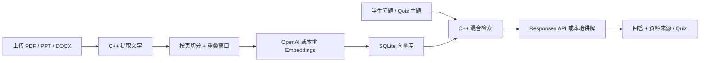

# Truth Learning

一个以 C++20 为核心的 AI Study Assistant。上传 PDF、PPT/PPTX、DOCX 或文字资料后，系统会提取文字、切分知识片段、生成 embeddings、写入 SQLite 向量库，再通过检索增强生成（RAG）完成资料内问答、教学讲解和 Quiz。

界面采用低刺激的鼠尾草绿、雾蓝与暖白配色，减少视觉噪声；首页记录当天的有效学习时间并给出动态鼓励，个人中心汇总累计时长、学习天数和最近 7 天趋势。

## 功能

- C++ 完成文件上传、解析、切片、embeddings、向量检索、RAG、Quiz 与计时数据持久化
- PDF 按页提取，PPTX 按幻灯片提取，DOCX 提取正文，兼容 TXT/Markdown/CSV 与旧版 PPT 的尽力解析
- OpenAI `text-embedding-3-small` embeddings + Responses API 教学回答与结构化出题
- 没有 API Key 时自动使用本地哈希 embeddings、混合检索和可溯源的提取式回答
- SQLite 保存资料、向量 BLOB、Quiz 成绩和每日学习时间
- 首页显示“今天你已经学习 x.x 小时”，按时长切换鼓励语
- 个人中心记录累计学习时长、学习天数、7 日趋势，支持补记离线学习时间
- Docker 一键运行，上传资料与数据库使用独立持久卷

## 工作流程



浏览器必须使用 HTML/CSS/JavaScript 来展示页面；这里的 JavaScript 仅处理交互和调用 API，业务逻辑与数据都由 C++ 服务端完成。

## 最快启动：Docker

```bash
cp .env.example .env
# 可选：在 .env 中填入 OPENAI_API_KEY
docker compose up --build
```

打开 <http://localhost:8080>。

## 本地构建

依赖：

- CMake 3.24+
- C++20 编译器
- SQLite3、libcurl
- 可选但推荐：poppler-cpp（PDF）、libzip（PPTX/DOCX）

Linux / macOS：

```bash
cmake -S . -B build -DCMAKE_BUILD_TYPE=Release
cmake --build build --parallel
ctest --test-dir build --output-on-failure
./build/truth_learning_server
```

Windows MSYS2 MinGW64：

```powershell
pacman -S --needed mingw-w64-x86_64-toolchain mingw-w64-x86_64-cmake `
  mingw-w64-x86_64-ninja mingw-w64-x86_64-sqlite3 mingw-w64-x86_64-curl `
  mingw-w64-x86_64-poppler mingw-w64-x86_64-libzip mingw-w64-x86_64-pkgconf

C:\msys64\mingw64\bin\cmake.exe -S . -B build -G Ninja
C:\msys64\mingw64\bin\cmake.exe --build build
C:\msys64\mingw64\bin\ctest.exe --test-dir build --output-on-failure
.\build\truth_learning_server.exe
```

如果本机没有 poppler-cpp 或 libzip，项目仍能构建，TXT/Markdown/CSV 和核心检索可用；Docker 镜像默认包含完整解析依赖。

## 配置

| 环境变量 | 默认值 | 说明 |
|---|---|---|
| `OPENAI_API_KEY` | 空 | 可选；为空时使用本地回退 |
| `OPENAI_CHAT_MODEL` | `gpt-5-mini` | Responses API 模型 |
| `OPENAI_BASE_URL` | `https://api.openai.com` | 可选兼容网关 |
| `PORT` | `8080` | HTTP 端口 |
| `TRUTH_DB_PATH` | `./data/truth-learning.db` | SQLite 路径 |
| `TRUTH_UPLOAD_DIR` | `./uploads` | 原始资料目录 |
| `TRUTH_PUBLIC_DIR` | `./public` | 前端静态文件目录 |

## API

| 方法 | 路径 | 用途 |
|---|---|---|
| `GET/POST/DELETE` | `/api/documents` | 列表、上传、删除资料 |
| `POST` | `/api/chat` | 基于资料问答与教学 |
| `POST` | `/api/quiz` | 基于资料生成 Quiz |
| `POST` | `/api/quiz/attempt` | 保存成绩 |
| `GET` | `/api/stats` | 知识库与练习统计 |
| `GET/POST` | `/api/study-time` | 查询或累计学习时间 |
| `GET` | `/api/health` | 健康与能力检查 |

## 设计与隐私说明

- 计时只在页面可见且最近 5 分钟有活动时累计，每 30 秒持久化一次，避免把长时间离开误算为学习。
- 回答会附带资料名和页码；资料不足时应明确指出，而不是补造内容。
- 上传的原文件与 SQLite 数据库默认只留在运行 Truth Learning 的机器或 Docker 卷中。
- 扫描版 PDF 没有文字层，需要先 OCR。旧 `.ppt` 是尽力解析，建议另存为 `.pptx` 或 PDF。
- 当前版本定位为个人本地学习工具，没有多用户登录与权限隔离；若部署到公网，请先增加认证、限流和对象存储。

## License

[MIT](LICENSE)

